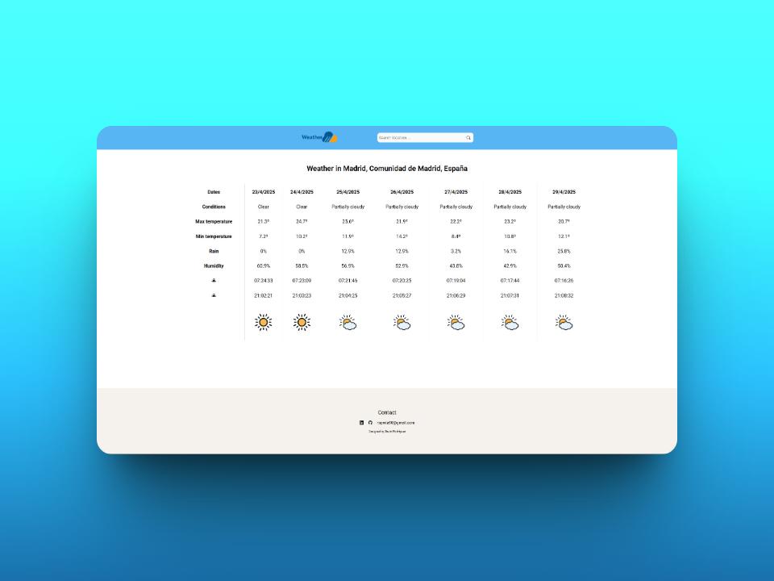

# 🌤️ WeatherApp - Informe climático de 7 días

**WeatherApp** es una aplicación web que muestra información detallada del clima para cualquier ciudad del mundo durante los próximos 7 días. Muestra condiciones como temperatura, humedad, probabilidad de lluvia, salida y puesta de sol, ¡con un diseño limpio y responsive!

## 📌 Descripción

Esta app conecta con la API de Visual Crossing para mostrar predicciones meteorológicas a 7 días en formato tabla. Presenta datos visuales intuitivos para facilitar la comprensión del clima, e incluye una búsqueda personalizada por ciudad.

## 🚀 Funcionalidades

- 🔎 Búsqueda por ciudad
- 📅 Predicción de 7 días con:
  - Temperatura máxima y mínima (ºC)
  - Condiciones meteorológicas
  - Porcentaje de precipitación
  - Humedad
  - Horas de salida y puesta del sol
  - Iconos visuales del clima
- 💻 Diseño responsive adaptable a móviles
- 🌐 Datos en tiempo real con API externa

## 🛠️ Tecnologías utilizadas

- **Frontend:** HTML5, CSS3, JavaScript (ES6+), Bootstrap Icons, Google Fonts
- **Backend:** Node.js + Express
- **API externa:** Visual Crossing Weather API

## 📂 Estructura del proyecto

```
weather-web/
│
├── backend/
│   └── server.js
│
├── frontend/
│   ├── index.html
│   ├── scripts/
│   │   ├── scripts.js
│   │   ├── functions.js
│   │   └── dataWeather.js
│   ├── style/
│   │   ├── reset.css
│   │   ├── root.css
│   │   └── style.css
│   └── assets/
│       ├── icons/
│       ├── images/
│       └── screenshots/
│           └── bigsize-1.png
│
├── .env
└── README.md
```

## 🖼️ Capturas de pantalla

Vista general del clima (Madrid):



## ⚙️ Instalación

1. Clona el repositorio:
```bash
git clone https://github.com/tu-usuario/weather-web.git
cd weather-web
```

2. Instala las dependencias (esto instalará `express`, `cors`, y `dotenv`):
```bash
cd backend
npm install
```

3. Crea un archivo `.env` en la raíz del proyecto con tu clave de API:
```
SECRET_KEY=tu_clave_de_visual_crossing
```

4. Inicia el servidor:
```bash
node server.js
```

5. Abre el archivo `frontend/index.html` en tu navegador o con Live Server.

## 🧠 Posibles mejoras

- Cambio de unidad de temperatura (ºC / ºF)
- Historial de búsquedas
- Predicciones horarias
- Modo oscuro

## 👩‍💻 Contacto

Si quieres ver más proyectos o ponerte en contacto conmigo:

- [GitHub](https://github.com/davidrguez98)
- [LinkedIn](https://www.linkedin.com/in/david-rodr%C3%ADguez-p%C3%A9rez-softdev/)
- Correo: ropeda98@gmail.com

¡Estoy abierto a colaboraciones, feedback o nuevas oportunidades!